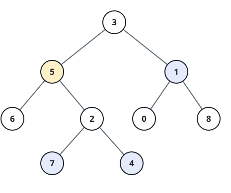

# Nodes at Tree Radius

## Description

You are given a binary tree `root`, the unique value `target` of one of its
nodes, and an integer `k`. Return the values of all nodes exactly `k` edges
away from the target node.

Paths may move from a child to its parent as well as from a parent to a child,
so view the tree as an undirected graph for this task. Return the selected
values in ascending order.

### Example 1



```text
Input: root = [3,5,1,6,2,0,8,null,null,7,4], target = 5, k = 2
Output: [1,4,7]
Explanation: Two edges from node 5 reach nodes 7 and 4 below it, and node 1
through its parent.
```

### Example 2

```text
Input: root = [10,5,15,3,7,12,18], target = 5, k = 2
Output: [15]
```

### Example 3

```text
Input: root = [4,2,6], target = 4, k = 1
Output: [2,6]
```

### Constraints

- The tree contains between `1` and `500` nodes.
- `0 <= Node.val <= 500`
- Node values are unique.
- `target` is the value of a node in the tree.
- `0 <= k <= 1000`
