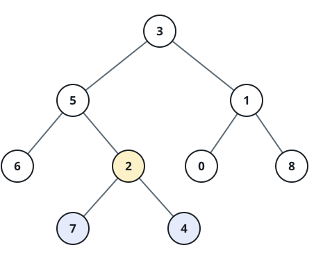

# Deepest-Node Enclosing Subtree

## Description

For a binary tree rooted at `root`, a node's depth is its number of edges from
the root. Find all nodes at the maximum depth, then return the root of the
smallest subtree containing every one of those deepest nodes.

A subtree includes its root and all descendants. The returned tree is encoded
in level order in the examples.

### Example 1



```text
Input: root = [3,5,1,6,2,0,8,null,null,7,4]
Output: [2,7,4]
Explanation: Nodes 7 and 4 are the deepest nodes. Their lowest shared
ancestor is node 2, so its subtree is the smallest enclosing one.
```

### Example 2

```text
Input: root = [8]
Output: [8]
```

### Example 3

```text
Input: root = [2,1,3]
Output: [2,1,3]
Explanation: Nodes 1 and 3 share the maximum depth, making the root their
smallest common enclosing subtree.
```

### Constraints

- The tree contains between `1` and `500` nodes.
- `0 <= Node.val <= 500`
- Node values are unique.
