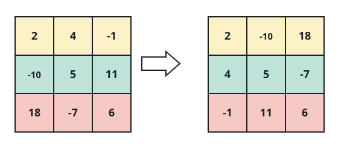

# Matrix Axis Swap

## Description

Given an `m x n` integer matrix `matrix`, build its axis-swapped form. Each
entry originally at row `i`, column `j` must appear at row `j`, column `i` in
the result.

Equivalently, every input row becomes a result column. The returned matrix
therefore has `n` rows and `m` columns.



### Example 1

```text
Input: matrix = [[2,-1,4],[0,7,9]]
Output: [[2,0],[-1,7],[4,9]]
Explanation: The 2 x 3 input becomes a 3 x 2 result after its row and column
positions are exchanged.
```

### Example 2

```text
Input: matrix = [[5,8],[-3,6],[1,0]]
Output: [[5,-3,1],[8,6,0]]
Explanation: Values from each input column form one row in the result.
```

### Constraints

- `m == matrix.length`
- `n == matrix[i].length`
- `1 <= m, n <= 1000`
- `1 <= m * n <= 10⁵`
- `-10⁹ <= matrix[i][j] <= 10⁹`

## Hints

### Hint 1

Allocate an `n x m` result. For every input location `(i, j)`, place its
value at `(j, i)` in that result.
