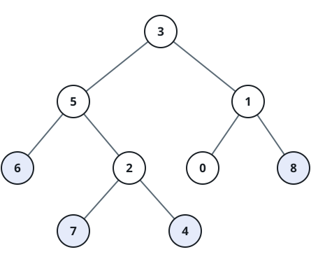
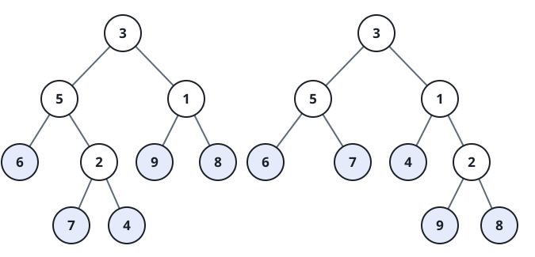
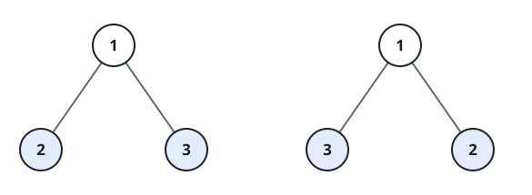

# Matching Leaf Traces

## Description

Read the leaves of a binary tree from left to right; the sequence of their
values is the tree's leaf trace.

For instance, the tree `[3,5,1,6,2,9,8,null,null,7,4]` has the leaf trace
`(6, 7, 4, 9, 8)`.



Two trees are leaf-similar when their leaf traces are identical. Given the
roots `root1` and `root2` of two trees, return `true` if they are
leaf-similar and `false` otherwise.

### Example 1



```text
Input: root1 = [3,5,1,6,2,9,8,null,null,7,4], root2 = [3,5,1,6,7,4,2,null,null,null,null,null,null,9,8]
Output: true
Explanation: Both trees produce the leaf trace (6, 7, 4, 9, 8).
```

### Example 2



```text
Input: root1 = [1,2,3], root2 = [1,3,2]
Output: false
Explanation: The left tree traces leaves as (2, 3), the right as (3, 2), so
their traces differ.
```

### Constraints

- Each tree has between `1` and `200` nodes, inclusive.
- Every node value lies in `[0, 200]`.
