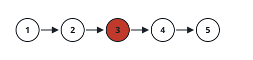
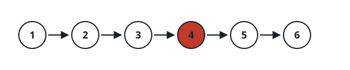

# Central List Node

## Description

Given the `head` of a singly linked list, return the node at the center of
the list.

When the list holds two central nodes, return the second of them.

### Example 1



```text
Input: head = [1,2,3,4,5]
Output: [3,4,5]
Explanation: The central node carries value 3; the answer is the suffix
starting there.
```

### Example 2



```text
Input: head = [1,2,3,4,5,6]
Output: [4,5,6]
Explanation: Two nodes, 3 and 4, share the center; the second one, 4, begins
the returned suffix.
```

### Constraints

- The list contains between `1` and `100` nodes, inclusive.
- `1 <= Node.val <= 100`
