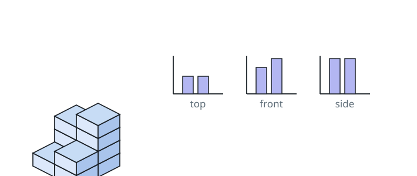

# Three-View Block Area

## Description

`grid` is an `n x n` board of vertical unit-cube stacks: `grid[i][j]` gives
the height of the stack standing on cell `(i, j)`. Add the areas visible when
the arrangement is viewed from above and from each of two perpendicular side
directions.

Return the sum of those three projected areas. A stack of height zero does not
appear in the top view.

### Example 1



```text
Input: grid = [[1,2],[3,4]]
Output: 17
```

The top view covers four cells. The row silhouettes contribute `2 + 4`, and
the column silhouettes contribute `3 + 4`.

### Example 2

```text
Input: grid = [[3]]
Output: 7
```

### Example 3

```text
Input: grid = [[0,2],[1,0]]
Output: 8
```

### Constraints

- `n == grid.length == grid[i].length`
- `1 <= n <= 50`
- `0 <= grid[i][j] <= 50`
