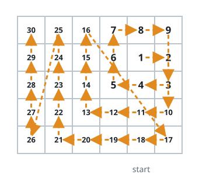

# Clockwise Grid Tour III

## Description

Start at `(rStart, cStart)` in a `rows x cols` grid, initially facing east.
Walk a clockwise square spiral: travel east once, south once, west twice,
north twice, then continue with runs of lengths `3, 3, 4, 4, ...` while
turning right after every run.

Keep taking the prescribed steps even outside the grid. Record only positions
inside the grid, and return all `rows * cols` grid coordinates in the order
recorded. The spiral eventually visits every cell exactly once.

### Example 1


```text
Input: rows = 1, cols = 4, rStart = 0, cStart = 0
Output: [[0,0],[0,1],[0,2],[0,3]]
```

The walk briefly travels beyond the one-row board before returning to record
the remaining cells.

### Example 2



```text
Input: rows = 5, cols = 6, rStart = 1, cStart = 4
Output: [[1,4],[1,5],[2,5],[2,4],[2,3],[1,3],[0,3],[0,4],[0,5],[3,5],[3,4],[3,3],[3,2],[2,2],[1,2],[0,2],[4,5],[4,4],[4,3],[4,2],[4,1],[3,1],[2,1],[1,1],[0,1],[4,0],[3,0],[2,0],[1,0],[0,0]]
```

### Constraints

- `1 <= rows, cols <= 100`
- `0 <= rStart < rows`
- `0 <= cStart < cols`
