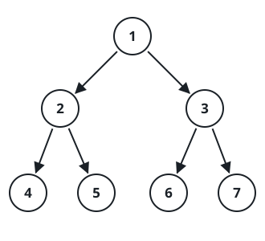

# Pre/Post Binary Tree Reconstruction

## Description

`preorder` and `postorder` are the preorder and postorder visits of one binary
tree with distinct integer values. Rebuild that tree and return its root.

These two traversals can describe more than one tree when a node has exactly
one child. In that case, resolve the ambiguity by making the only child the
left child.

### Example 1



```text
Input: preorder = [1,2,4,5,3,6,7], postorder = [4,5,2,6,7,3,1]
Output: [1,2,3,4,5,6,7]
```

### Example 2

```text
Input: preorder = [4,2,1,3], postorder = [1,3,2,4]
Output: [4,2,null,1,3]
```

### Constraints

- `1 <= preorder.length <= 30`
- `1 <= preorder[i] <= preorder.length`
- All values in `preorder` are distinct.
- `postorder.length == preorder.length`
- `1 <= postorder[i] <= postorder.length`
- All values in `postorder` are distinct.
- The two arrays are traversals of the same binary tree.
