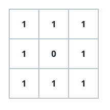

# Cube Tower Surface

## Description

`grid` is an `n x n` board. A value `grid[i][j]` gives the height of a tower
of unit cubes standing on that cell. Cubes that share a face are joined.

Find the total area of every face that remains exposed to the outside. The
bottom of each tower is included in that area.

### Example 1


```text
Input: grid = [[1,2],[3,4]]
Output: 34
Explanation: The visible tops and bottoms contribute 8 faces. Comparing each
tower with its neighbors leaves 26 side faces exposed, for a total of 34.
```

### Example 2



```text
Input: grid = [[1,1,1],[1,0,1],[1,1,1]]
Output: 32
Explanation: The eight towers expose 16 horizontal faces. Their outer walls
contribute 12 faces and the walls around the empty center contribute 4 more.
```

### Example 3


```text
Input: grid = [[2,2,2],[2,1,2],[2,2,2]]
Output: 46
Explanation: The occupied cells supply 18 horizontal faces. The perimeter
adds 24 vertical faces, and the taller surrounding towers expose 4 more faces
next to the center tower.
```

### Constraints

- `grid` is square: `n == grid.length == grid[i].length`.
- `1 <= n <= 50`
- `0 <= grid[i][j] <= 50`
