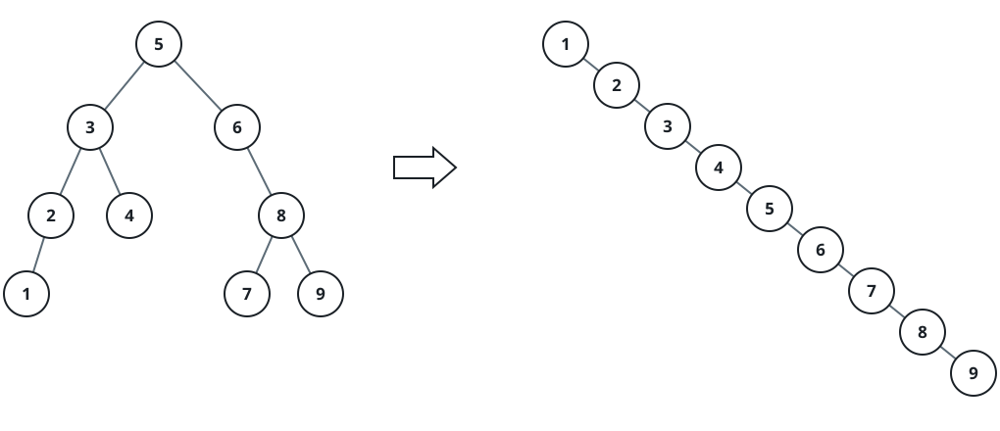
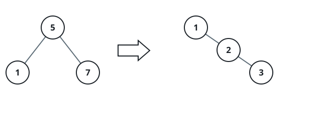

# Sorted BST Spine

## Description

Given the root of a binary search tree, rearrange its existing nodes into a
new tree whose nodes form one increasing chain. The smallest value becomes the
new root, every node has no left child, and each node's only possible child is
the next larger node on its right.

Return the root of that chain.

### Example 1



```text
Input: root = [5,3,6,2,4,null,8,1,null,null,null,7,9]
Output: [1,null,2,null,3,null,4,null,5,null,6,null,7,null,8,null,9]
Explanation: Reading the original search tree in sorted order yields the
right-only chain from 1 through 9.
```

### Example 2



```text
Input: root = [5,1,7]
Output: [1,null,5,null,7]
```

### Constraints

- The input tree contains from `1` through `100` nodes.
- `0 <= Node.val <= 1000`
