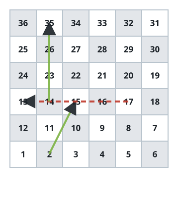

# Shortest Board-Game Route

## Description

An `n x n` board contains squares labeled `1` through `n²` in a serpentine
path beginning at the bottom-left: the bottom row runs left to right, the row
above runs right to left, and directions continue alternating upward.

Start on square `1`. On one move, choose a forward destination from
`curr + 1` through `min(curr + 6, n²)`, as if choosing a six-sided die result.
If that destination holds a shortcut or setback (`board[r][c] != -1`), move
immediately to the label stored there. A shortcut or setback is used at most
once for a roll: landing on the start of another one does not trigger it.

Reach square `n²` using as few moves as possible. Return that minimum, or
`-1` if the final square cannot be reached. Squares `1` and `n²` never begin
a shortcut or setback.

### Example 1



```text
Input: board =
[[-1,-1,-1,-1,-1,-1]
,[-1,-1,-1,-1,-1,-1]
,[-1,-1,-1,-1,-1,-1]
,[-1,35,-1,-1,13,-1]
,[-1,-1,-1,-1,-1,-1]
,[-1,15,-1,-1,-1,-1]]
Output: 4
Explanation: A route can use 2 → 15, then 17 → 13, then 14 → 35, and finally
36. No route finishes in fewer than four moves.
```

### Example 2

```text
Input: board = [[-1,-1,-1],[-1,-1,-1],[-1,-1,8]]
Output: 2
Explanation: The first move can land on square 3 and take its shortcut to 8;
one more roll reaches 9.
```

### Constraints

- `n == board.length == board[i].length`
- `2 <= n <= 20`
- `board[i][j]` is either `-1` or in the range `[1, n²]`.
- Squares `1` and `n²` are not the starting cells of a shortcut or setback.
