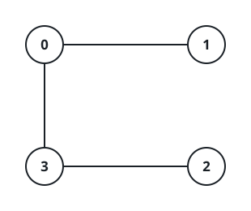

# Mouse Escape Game

## Description

The Mouse and the Cat take turns moving on an undirected graph represented by
an adjacency list: `graph[a]` lists every node adjacent to node `a`.

The Mouse begins at node `1` and moves first. The Cat begins at node `2` and
moves second. Node `0` is an escape hole. On a turn, a player must move along
one adjacent edge. The Cat may never move into node `0`.

The game ends immediately when one of these conditions occurs:

- The Mouse reaches node `0`, so the Mouse wins.
- The Cat and Mouse occupy the same node, so the Cat wins.
- A complete position repeats (both locations and the player whose turn it
  is), so the game is a draw.

Assuming perfect play by both sides, return `1` for a Mouse win, `2` for a Cat
win, and `0` for a draw.

### Example 1


```text
Input: graph = [[2,5],[3],[0,4,5],[1,4,5],[2,3],[0,2,3]]
Output: 0
Explanation: Neither side can force its winning condition. The Cat can guard
the entrances to node 0 while the Mouse keeps away from the Cat, eventually
repeating a complete position.
```

### Example 2



```text
Input: graph = [[1,3],[0],[3],[0,2]]
Output: 1
Explanation: The Mouse's only move from node 1 goes directly to the hole at
node 0, so it wins before the Cat can move.
```

### Constraints

- `3 <= graph.length <= 50`
- `1 <= graph[i].length < graph.length`
- `0 <= graph[i][j] < graph.length`
- `graph[i][j] != i`
- Each adjacency list has no duplicate node values.
- Both the Mouse and Cat always have a legal move from their starting state.

## Hints

### Hint 1

A game position is fully described by three facts: the Mouse's node, the
Cat's node, and whose turn is next. There are only `2 * n²` such positions.

### Hint 2

Rather than simulate uncertain forward play, begin with positions whose winner
is already known: Mouse-at-hole and Cat-on-Mouse positions.

### Hint 3

Propagate those results backward. A player wins a predecessor if it can move
into a state it wins; it loses only after all of its legal moves lead to an
opponent win. States never resolved by this process are draws.
