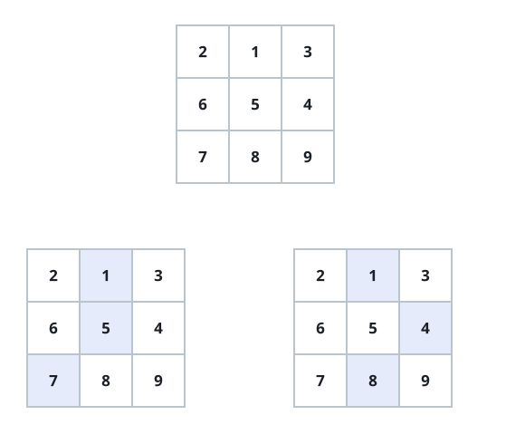
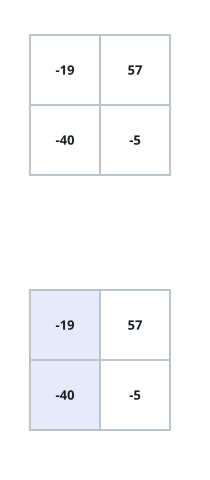

# Lowest Matrix Descent

## Description

Given an `n x n` grid of integers, find the cheapest way to travel from
the top row to the bottom row. A descent starts at any single cell of the
first row, then picks exactly one cell from every row below it. Between
consecutive rows the column may hold steady or drift by one: after
visiting column `c` of some row, the next cell can be in column `c - 1`,
`c`, or `c + 1`, as long as it stays inside the grid. A descent's cost is
the sum of the `n` values it visits, and you return the smallest cost any
descent can achieve.

### Example 1



```text
Input: matrix = [[2,1,3],[6,5,4],[7,8,9]]
Output: 13
Explanation: Starting from the 1 on the top row, the two cheapest routes
down are 1 -> 4 -> 8 (drift right, then left) and 1 -> 5 -> 7 (drop
straight down, then left). Both cost 13 and nothing cheaper exists.
```

### Example 2



```text
Input: matrix = [[-19,57],[-40,-5]]
Output: -59
Explanation: The winning route falls straight down the first column,
collecting -19 and then -40 for a total of -59.
```

### Example 3

```text
Input: matrix = [[10,-3,4,1],[2,9,-8,6],[7,1,5,-2],[-4,8,0,3]]
Output: -14
Explanation: The best route is -3 -> -8 -> 1 -> -4: it drifts right to
grab the -8, then cuts back left in each of the next two steps to finish
on -4, summing to -14.
```

### Constraints

- `matrix` is square: it has `n` rows, each holding exactly `n` values.
- `1 <= n <= 100`
- `-100 <= matrix[i][j] <= 100`
