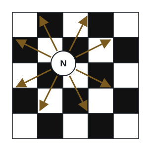
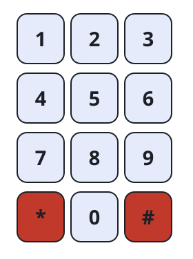

# Knight Keypad Paths

## Description

A chess knight moves in an L shape: two cells along one axis and one cell
along the other.



Place a knight on any digit of this keypad. It may land on digits only;
`*` and `#` are unusable.

| 1   | 2   | 3   |
| --- | --- | --- |
| 4   | 5   | 6   |
| 7   | 8   | 9   |
| *   | 0   | #   |



Given `n`, count the distinct digit strings of length `n` that the knight
can produce. The first digit is its starting cell, and every later digit
must be reached by one legal knight move. The start may be any of the ten
digits.

Return the count modulo `10⁹ + 7`.

### Example 1

```text
Input: n = 3
Output: 46
```

### Example 2

```text
Input: n = 4
Output: 104
```

### Example 3

```text
Input: n = 100
Output: 540641702
Explanation: Apply the required modulus while counting longer paths.
```

### Constraints

- `1 <= n <= 5000`
