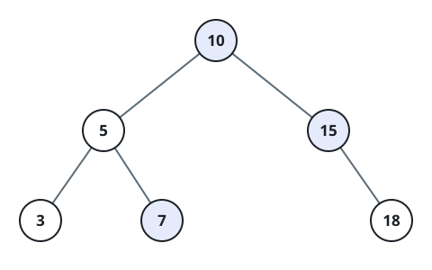
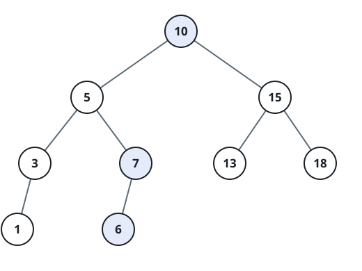

# BST Window Sum

## Description

Given the `root` of a binary search tree and integers `low` and `high`,
add the values stored in every node whose value lies in the inclusive
interval `[low, high]`. Return that total.

### Example 1



```text
Input: root = [10,5,15,3,7,null,18], low = 7, high = 15
Output: 32
Explanation: The in-range values are 7, 10, and 15, whose total is 32.
```

### Example 2



```text
Input: root = [10,5,15,3,7,13,18,1,null,6], low = 6, high = 10
Output: 23
Explanation: The qualifying values are 6, 7, and 10.
```

### Constraints

- The tree has between `1` and `2 * 10⁴` nodes.
- `1 <= Node.val <= 10⁵`
- `1 <= low <= high <= 10⁵`
- Node values are unique.
