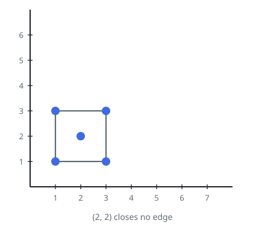
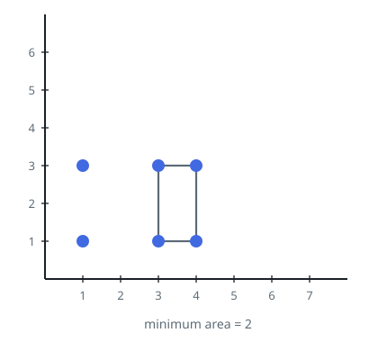

# Smallest Corner Rectangle

## Description

The array `points` lists distinct coordinates in the plane, with
`points[i] = [xi, yi]`.

Find the smallest area of any non-degenerate rectangle whose four corners
all occur in `points` and whose sides are parallel to the coordinate axes.
Such a rectangle uses two different x-coordinates and two different
y-coordinates. Return `0` if the supplied points cannot form one.

### Example 1



```text
Input: points = [[1,1],[1,3],[3,1],[3,3],[2,2]]
Output: 4
Explanation: The four outer corner points form a rectangle 2 units wide
and 2 units high. The point at (2,2) is inside it and does not supply a
corner.
```

### Example 2



```text
Input: points = [[1,1],[1,3],[3,1],[3,3],[4,1],[4,3]]
Output: 2
Explanation: The rectangle from x = 3 to x = 4 has width 1 and height 2,
so its area 2 is the minimum available.
```

### Constraints

- `1 <= points.length <= 500`
- `points[i].length == 2`
- `0 <= xi, yi <= 4 * 10⁴`
- All points are distinct.
