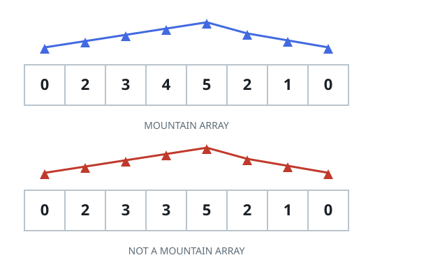

# Strict Peak Profile

## Description

Decide whether a row of numbers rises to exactly one summit and then falls
all the way back down, with nothing but strict steps on both sides. The
array `arr` qualifies — call it a strict peak profile — exactly when:

- it holds at least three values, so a summit can sit strictly inside;
- the values climb strictly to a single peak element — each one larger
  than the value before it — and then fall strictly after it — each one
  smaller than the value before it — through to the last element.

The summit may not be the first or the last element: a profile that only
ever climbs or only ever falls does not qualify. Equal side-by-side values
are forbidden everywhere, and once the way down starts the values may
never tick back up. Return `true` when `arr` forms such a profile and
`false` otherwise.



### Example 1

```text
Input: arr = [1,4,7,5,2]
Output: true
Explanation: The values climb 1 < 4 < 7 up to the summit 7 at index 2,
then fall strictly 7 > 5 > 2 through the end.
```

### Example 2

```text
Input: arr = [2,6,9]
Output: false
Explanation: The values only ever climb; there is no descending leg after
a peak, since the largest value sits at the very end.
```

### Example 3

```text
Input: arr = [1,5,5,2]
Output: false
Explanation: The climb reaches 5 but then meets an equal 5 rather than a
strictly smaller value, so the way down never strictly begins.
```

### Constraints

- `1 <= arr.length <= 10⁴`
- `0 <= arr[i] <= 10⁴`

### Hint 1

March from the left end for as long as each value beats the one before it.
Wherever that climb halts is the only candidate summit; from there every
remaining value must be strictly smaller than its predecessor, straight to
the end. If the halt lands on the first or last index, or any later step
fails to drop, the answer is `false`.
