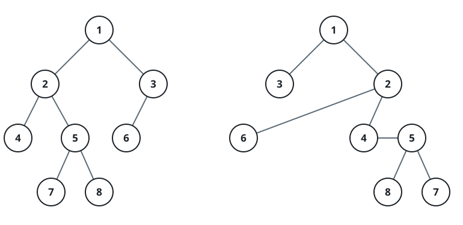

# Swap-Equivalent Trees

## Description

A swap operation on a binary tree picks any one node and exchanges its
left and right child subtrees, leaving everything inside those subtrees
untouched. Two binary trees are swap-equivalent when some sequence of
swap operations — applied to either tree — can turn the first into an
exact copy of the second, node for node and position for position.

You receive the roots of two binary trees, `root1` and `root2`. Return
`true` when the trees are swap-equivalent and `false` otherwise.

### Example 1



```text
Input: root1 = [1,2,3,4,5,6,null,null,null,7,8], root2 = [1,3,2,null,6,4,5,null,null,null,null,8,7]
Output: true
Explanation: Three swaps make the trees match — at the nodes holding 1,
3, and 5.
```

### Example 2

```text
Input: root1 = [2,1,3], root2 = [2,3,1]
Output: true
Explanation: One swap at the root exchanges the leaves 1 and 3, turning
the first tree into the second.
```

### Example 3

```text
Input: root1 = [5,2,8,1], root2 = [5,8,2,null,null,null,1]
Output: true
Explanation: A swap at the root puts 8 on the left and 2 on the right;
a second swap at the node holding 2 moves its leaf 1 to the right,
matching the second tree exactly.
```

### Example 4

```text
Input: root1 = [1,2,3], root2 = [1,2,3,4]
Output: false
Explanation: The second tree holds one more node than the first, and
swaps never create or destroy nodes, so they can never be made equal.
```

### Constraints

- each tree holds between `0` and `100` nodes
- within each tree the node values are unique and lie in the range
  `[0, 99]`
