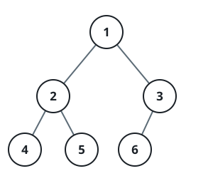
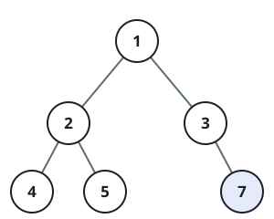

# Heap-Shaped Tree Completeness

## Description

A binary tree arrives through its `root`; decide whether the tree it
roots is complete.

Completeness is a property of positions, not of values. Picture the
slots a binary heap numbers off: the root takes slot 1, and the children
of slot `i` take slots `2i` and `2i+1`. A tree is complete exactly when
its nodes fill the first `n` slots of that numbering with no hole among
them. Every level above the last is then completely filled, while the
last level — allowed to hold anywhere from `1` to `2^h` nodes when it
lies at depth `h` — presses up against the left edge.

### Example 1



```text
Input: root = [1,2,3,4,5,6]
Output: true
Explanation: Slots 1 through 6 are all taken, so the two upper levels
(holding values {1} and {2, 3}) are full and the leaf level {4, 5, 6}
sits flush against the left side.
```

### Example 2



```text
Input: root = [1,2,3,4,5,null,7]
Output: false
Explanation: Node 7 hangs off the right branch of 3. It occupies slot 7
even though slot 6 was never filled, punching a hole into the middle of
the last level — the occupied slots stop forming an unbroken prefix.
```

### Example 3

```text
Input: root = [1,2,3,4,5,6,null,8]
Output: false
Explanation: The node with value 8 lands in slot 8, one place to the
right of where the heap numbering would have it, because 3's right slot
went unfilled. A complete tree could not leave that gap behind.
```

### Constraints

- The tree contains between `1` and `100` nodes.
- Every node value is an integer in `[1, 1000]`.
