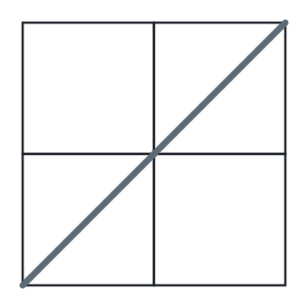
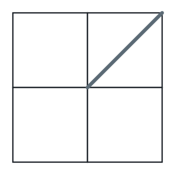
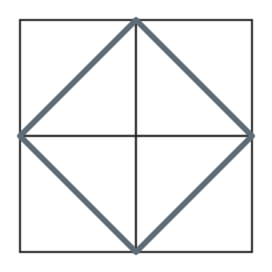

# Slash-Carved Grid Regions

## Description

An `n x n` board is delivered as `n` strings of length `n`; character
`(i, j)` decorates the square at row `i`, column `j`. The decoration is
always one of three things: a forward slash `/`, a backslash `\`, or a
blank space ` `. Each slash shape is a wall drawn across its square —
`/` runs corner to corner from bottom-left to top-right, `\` from
top-left to bottom-right — while a blank square stays fully open. Once
every wall is standing, the board's empty space falls into connected
patches: two empty points belong to the same patch when a path between
them can dodge every wall, and walls may be slipped around at a corner
but never crossed.

Count the patches and return that count.

One mechanical note: a backslash is escaped inside `grid`, so a square
holding `\` contributes the two-character escape `\\` to its row string.

### Example 1



```text
Input: grid = [" /", "/ "]
Output: 2
Explanation: The two walls run parallel without touching, so each one
slices the board on its own and two wedges remain.
```

### Example 2



```text
Input: grid = [" /", "  "]
Output: 1
Explanation: A lone wall partitions nothing — empty space detours around
its two ends, so the board stays one connected piece.
```

### Example 3



```text
Input: grid = ["/\\", "\\/"]
Output: 5
Explanation: Unescaping the rows gives /\ and \/. The four segments
chain end to end into a diamond whose tips touch the midpoint of each
side of the board, isolating the diamond's interior plus the board's
four corners — five patches in all.
```

### Constraints

- `n == grid.length == grid[i].length`
- `1 <= n <= 30`
- Every character of `grid[i]` is `/`, `\`, or a blank space.
