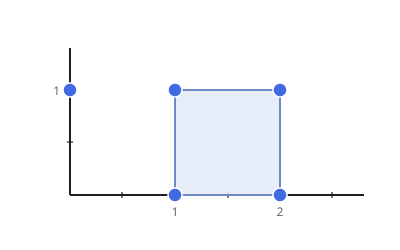

# Smallest Rectangle at Any Angle

## Description

A set of points in the X-Y plane arrives as `points`, where
`points[i] = [xi, yi]`. Pick out four of them to corner a rectangle —
and the rectangle may lean however it likes, because its sides do not
have to run parallel to the axes. The single demand is that all four
corners come from `points`.

Over every rectangle these points can corner, find the smallest area.
If no four of them close into a rectangle at all, return `0`.

Answers within `10⁻⁵` of the true minimum are accepted.

### Example 1


```text
Input: points = [[1,2],[2,1],[1,0],[0,1]]
Output: 2.00000
Explanation: The four points corner a square stood up on one of its
corners, its sides running at 45 degrees to the axes, and that square's
area of 2 is the smallest any rectangle here achieves.
```

### Example 2



```text
Input: points = [[0,1],[2,1],[1,1],[1,0],[2,0]]
Output: 1.00000
Explanation: An axis-parallel unit square hides among five points; its
four corners give the smallest rectangle, of area 1.
```

### Example 3


```text
Input: points = [[0,3],[1,2],[3,1],[1,3],[2,1]]
Output: 0
Explanation: However the five points are split into corner fours, none
of the quadrilaterals is a rectangle, so there is nothing to measure.
```

### Constraints

- `1 <= points.length <= 50`
- `points[i].length == 2`
- `0 <= xi, yi <= 4 * 10⁴`
- Every point in `points` is distinct.
