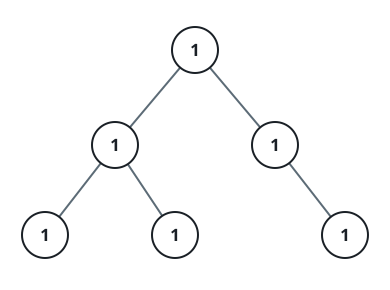

# One-Value Binary Tree

## Description

A binary tree is one-value when the same value sits at every node — look at
any node in the tree and its value matches every other node's.

Given the `root` of a binary tree, report whether the tree is one-value:
return `true` when no node breaks the agreement, or `false` otherwise.

### Example 1



```text
Input: root = [1,1,1,1,1,null,1]
Output: true
Explanation: The value 1 appears at every node of the tree.
```

### Example 2


```text
Input: root = [2,2,2,5,2]
Output: false
Explanation: The single node holding 5 breaks the agreement the rest of the
tree has on 2.
```

### Constraints

- The tree holds between 1 and 100 nodes.
- Every node value is an integer from 0 through 99.
