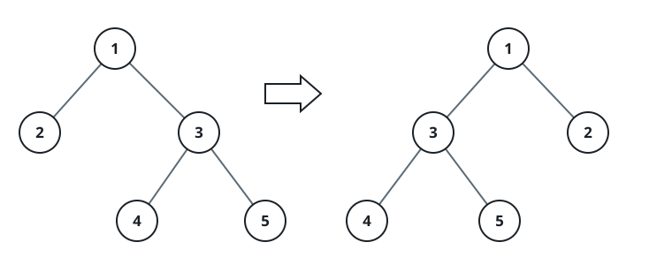
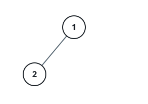
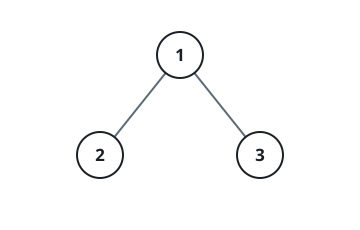

# Flip-Guided Preorder Walk

## Description

A binary tree contains `n` nodes whose values are the distinct integers from
`1` to `n`. You are also handed an array `voyage` of `n` values: the exact
node sequence that a preorder traversal of the tree is supposed to emit.

One operation is available on the tree. Flipping a node exchanges that
node's two subtrees, left for right.



Flip as few nodes as possible so that walking the tree in preorder emits
precisely `voyage`, and report the values of every node you flipped, listed
in the order the resulting traversal encounters them. If no choice of flips
can bring the traversal in line with `voyage`, report `[-1]`.

### Example 1



```text
Input: root = [1,2], voyage = [2,1]
Output: [-1]
Explanation: No set of flips steers the traversal into agreement with
voyage.
```

### Example 2


```text
Input: root = [1,2,3], voyage = [1,3,2]
Output: [1]
Explanation: Flipping node 1 trades its two children's positions, and the
preorder traversal then reads 1, 3, 2 — exactly voyage.
```

### Example 3



```text
Input: root = [1,2,3], voyage = [1,2,3]
Output: []
Explanation: The tree already produces voyage under a plain preorder walk,
so nothing has to be flipped.
```

### Constraints

- The tree holds `n` nodes, where `n == voyage.length`.
- `1 <= n <= 100`
- `1 <= Node.val, voyage[i] <= n`
- The node values are all distinct.
- The values in `voyage` are all distinct.
