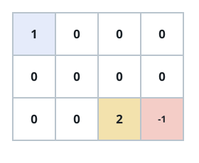
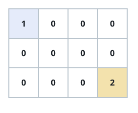
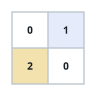

# Full Grid Tours III

## Description

A grid of cells is given, each cell holding one of four values:

- `1` marks the single starting cell.
- `2` marks the single ending cell.
- `0` marks an open cell that may be walked through.
- `-1` marks a blocked cell that can never be entered.

Count the walks that begin at the starting cell, move one cell at a time
in the four edge-adjacent directions, finish at the ending cell, and set
foot on every non-blocked cell exactly once along the way. Return how many
distinct walks of that kind exist.

### Example 1



```text
Input: grid = [[1,0,0,0],[0,0,0,0],[0,0,2,-1]]
Output: 2
Explanation: The two qualifying walks are:
1. (0,0),(0,1),(0,2),(0,3),(1,3),(1,2),(1,1),(1,0),(2,0),(2,1),(2,2)
2. (0,0),(1,0),(2,0),(2,1),(1,1),(0,1),(0,2),(0,3),(1,3),(1,2),(2,2)
```

### Example 2



```text
Input: grid = [[1,0,0,0],[0,0,0,0],[0,0,0,2]]
Output: 4
Explanation: The four qualifying walks are:
1. (0,0),(0,1),(0,2),(0,3),(1,3),(1,2),(1,1),(1,0),(2,0),(2,1),(2,2),(2,3)
2. (0,0),(0,1),(1,1),(1,0),(2,0),(2,1),(2,2),(1,2),(0,2),(0,3),(1,3),(2,3)
3. (0,0),(1,0),(2,0),(2,1),(2,2),(1,2),(1,1),(0,1),(0,2),(0,3),(1,3),(2,3)
4. (0,0),(1,0),(2,0),(2,1),(1,1),(0,1),(0,2),(0,3),(1,3),(1,2),(2,2),(2,3)
```

### Example 3



```text
Input: grid = [[0,1],[2,0]]
Output: 0
Explanation: No walk can cover every open cell exactly once in this grid.
Note that the starting and ending cells may sit anywhere in the grid.
```

### Constraints

- The grid has `m` rows and `n` columns, with `1 <= m, n <= 20`.
- `1 <= m * n <= 20`
- Every cell holds `-1`, `0`, `1`, or `2`.
- Exactly one cell is the starting cell and exactly one is the ending
  cell.
