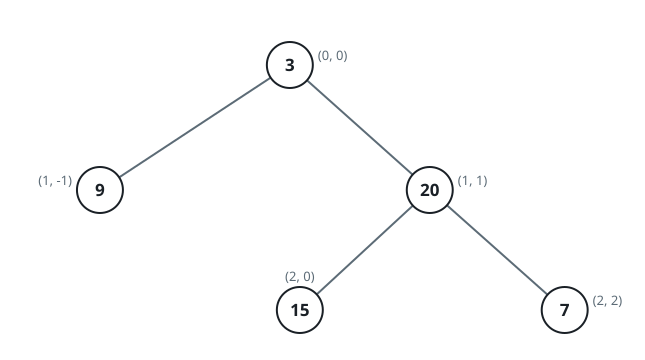
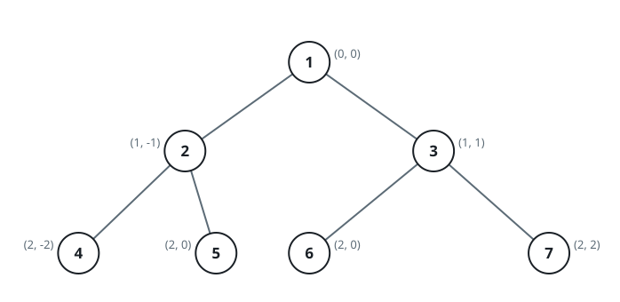

# Binary Tree Column Groups

## Description

Place the nodes of a binary tree on a grid: the root sits at row 0,
column 0, and every child occupies the row just below its parent — a left
child one column to the left of it, a right child one column to the right.

Group the nodes into columns and read the groups left to right. Within a
column, nodes are listed from top to bottom, and when several nodes share
one row of one column, value order breaks the tie. Return the groups as a
list of value lists, one per column from the leftmost to the rightmost.

### Example 1



```text
Input: root = [3,9,20,null,null,15,7]
Output: [[9],[3,15],[20],[7]]
Explanation: Node 9 forms column -1 on its own. Column 0 holds the root 3
with 15 below it, while nodes 20 and 7 each get a column of their own.
```

### Example 2



```text
Input: root = [1,2,3,4,5,6,7]
Output: [[4],[2],[1,5,6],[3],[7]]
Explanation: Columns -2 and -1 contain only 4 and 2. Column 0 stacks 1,
5, and 6: the root sits highest, and 5 and 6 share one cell, so value
order puts 5 first. Columns 1 and 2 contain only 3 and 7.
```

### Example 3


```text
Input: root = [1,2,3,4,6,5,7]
Output: [[4],[2],[1,5,6],[3],[7]]
Explanation: This tree is example 2 with the values 5 and 6 exchanged.
The answer does not change: the two nodes occupy the same cell and are
ordered by value, not by identity.
```

### Constraints

- The tree holds between 1 and 1000 nodes.
- `0 <= Node.val <= 1000`
