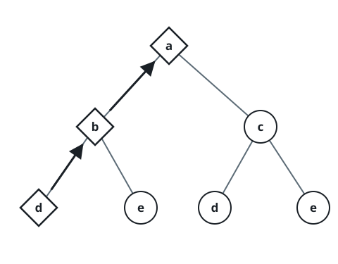
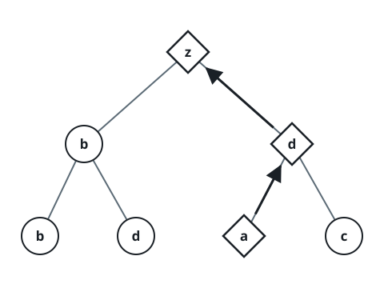
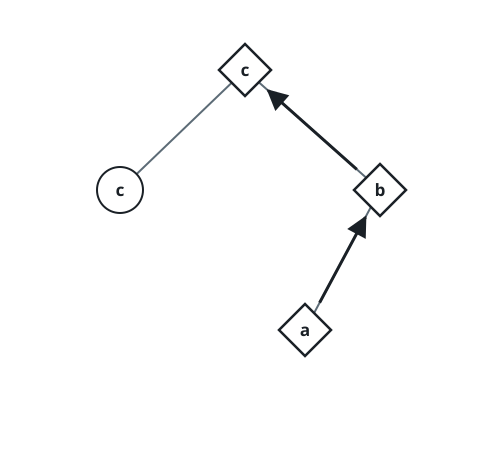

# Smallest Backward Leaf Word

## Description

Each node of the given binary tree carries a value between `0` and `25`,
naming the letter that far along in the lowercase alphabet — `0` spells
`'a'`, `25` spells `'z'`. Tracing any path from the `root` down to a leaf
and then reading the letters from the leaf back up to the `root` produces
one string. Return the lexicographically smallest string producible this
way.

Two strings compare lexicographically character by character, and a
proper prefix loses to the string that extends it: `"ab"` sorts before
`"aba"`. A leaf is a node with no children.

### Example 1



```text
Input: root = [0,1,2,3,4,3,4]
Output: "dba"
```

### Example 2



```text
Input: root = [25,1,3,1,3,0,2]
Output: "adz"
```

### Example 3



```text
Input: root = [2,2,1,null,1,0,null,0]
Output: "abc"
```

### Constraints

- The tree contains between `1` and `8500` nodes.
- Every node value is an integer in the range `[0, 25]`.
