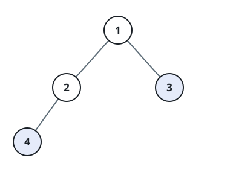
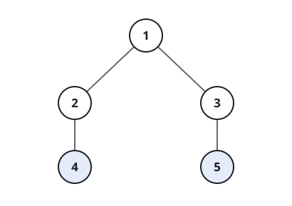
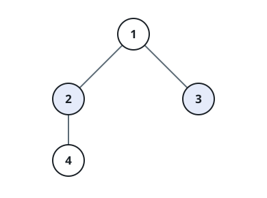

# Same Depth, Separate Parents

## Description

Two nodes of a binary tree are called related-by-depth-but-not-by-parent —
cousins, for short — when they rest on the same level of the tree yet hang
from two different nodes.

You are given the `root` of a binary tree whose node values are all
distinct, together with the values `x` and `y` of two different nodes that
both exist in the tree. Report whether the nodes holding `x` and `y` are
cousins.

Levels are counted from the `root`, which sits alone at depth `0`; the
children of a depth-`k` node live at depth `k + 1`.

### Example 1



```text
Input: root = [1,2,3,4], x = 4, y = 3
Output: false
Explanation: Value 4 sits one level below value 3, so the two nodes are
not on the same level.
```

### Example 2



```text
Input: root = [1,2,3,null,4,null,5], x = 5, y = 4
Output: true
Explanation: Values 5 and 4 share a level, and they hang from different
nodes (3 and 2 respectively).
```

### Example 3



```text
Input: root = [1,2,3,null,4], x = 2, y = 3
Output: false
Explanation: Values 2 and 3 do share a level, but the root is the parent
of both — siblings, not cousins.
```

### Constraints

- The tree holds between `2` and `100` nodes.
- `1 <= Node.val <= 100`, and no value repeats.
- `x != y`
- Both `x` and `y` occur somewhere in the tree.
