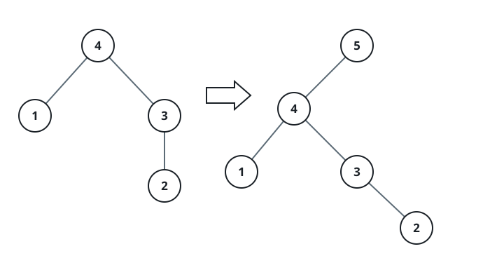
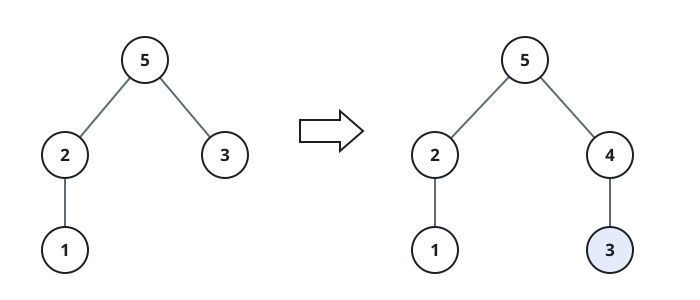

# Extend the Maximum Tree II

## Description

Call a binary tree a **maximum tree** when every node's value is the largest
value anywhere in its own subtree. Such a tree can be built from an array
`a` by the recursive routine `Construct(a)`:

- If `a` is empty, return null.
- Otherwise let `a[i]` be the largest element of `a`, and create the root
  node with value `a[i]`.
- The left child of the root is `Construct([a[0], a[1], ..., a[i - 1]])`.
- The right child of the root is
  `Construct([a[i + 1], a[i + 2], ..., a[a.length - 1]])`.
- Return the root.

You are not given the array itself — only the root of a maximum tree that
was built from one. You are also given an integer `val`. Imagine appending
`val` to the end of that underlying array, producing a new array `b`; it is
guaranteed that `b` has unique values.

Return `Construct(b)`.

### Example 1



```text
Input: root = [4,1,3,null,null,2], val = 5
Output: [5,4,null,1,3,null,null,2]
Explanation: The underlying array was a = [1,4,2,3], so b = [1,4,2,3,5].
The appended 5 beats every existing node, making it the new root with the
old tree as its left child.
```

### Example 2


```text
Input: root = [5,2,4,null,1], val = 3
Output: [5,2,4,null,1,null,3]
Explanation: Here a = [2,1,5,4] and b = [2,1,5,4,3]. The appended 3
travels down the rightmost branch and settles as the right child of 4.
```

### Example 3



```text
Input: root = [5,2,3,null,1], val = 4
Output: [5,2,4,null,1,3]
Explanation: Here a = [2,1,5,3] and b = [2,1,5,3,4]. The appended 4 stops
below 5 but above 3, so it takes over 3's slot as the right child of 5
and keeps 3 as its own left child.
```

### Constraints

- The number of nodes in the given tree is in the range `[1, 100]`.
- `1 <= Node.val <= 100`
- All values in the given tree are unique.
- `1 <= val <= 100`
