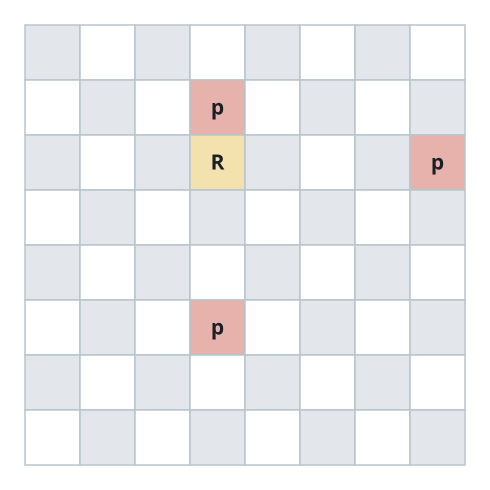
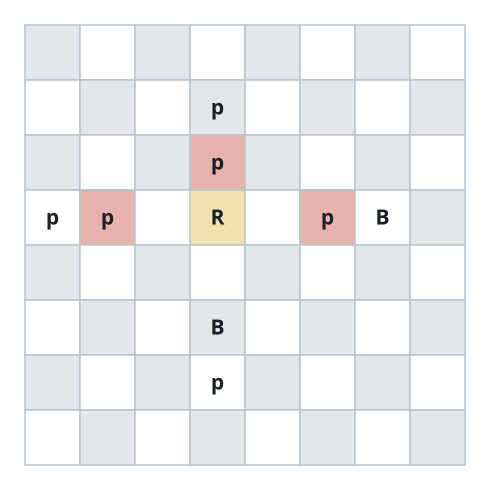

# Rook Capture Tally

## Description

An 8 x 8 grid models a chessboard. Exactly one square holds the white rook
`R`; the remaining squares hold white bishops `B`, black pawns `p`, or
nothing at all (`.`).

In one move the rook travels any number of squares along its row or column —
up, down, left or right — and it must stop at the first piece it meets in
that direction, or at the board's edge, whichever arrives first. The rook
attacks a pawn exactly when that pawn is the first piece the rook meets in
one of the four directions: any piece standing between the rook and a pawn
shields it completely.

Return how many black pawns the white rook attacks.

### Example 1



```text
Input: board = [[".",".",".",".",".",".",".","."],[".",".",".","p",".",".",".","."],[".",".",".","R",".",".",".","p"],[".",".",".",".",".",".",".","."],[".",".",".",".",".",".",".","."],[".",".",".","p",".",".",".","."],[".",".",".",".",".",".",".","."],[".",".",".",".",".",".",".","."]]
Output: 3
Explanation: The first piece upward, downward and rightward of the rook is
a pawn each time; leftward the rook reaches the edge without meeting
anything. All three pawns on the board are attacked.
```

### Example 2


```text
Input: board = [[".",".",".",".",".",".",".","."],[".","p","p","p","p","p",".","."],[".","p","p","B","p","p",".","."],[".","p","B","R","B","p",".","."],[".","p","p","B","p","p",".","."],[".","p","p","p","p","p",".","."],[".",".",".",".",".",".",".","."],[".",".",".",".",".",".",".","."]]
Output: 0
Explanation: A bishop stands adjacent to the rook in every one of the four
directions, so no direction ever reaches a pawn.
```

### Example 3



```text
Input: board = [[".",".",".",".",".",".",".","."],[".",".",".","p",".",".",".","."],[".",".",".","p",".",".",".","."],["p","p",".","R",".","p","B","."],[".",".",".",".",".",".",".","."],[".",".",".","B",".",".",".","."],[".",".",".","p",".",".",".","."],[".",".",".",".",".",".",".","."]]
Output: 3
Explanation: Upward, leftward and rightward the rook meets a pawn first —
at d6, b5 and f5 respectively — while downward a bishop blocks the way,
for a tally of 3.
```

### Constraints

- `board.length == 8`
- `board[i].length == 8`
- `board[i][j]` is `'R'`, `'B'`, `'p'`, or `'.'`
- Exactly one cell of the board contains `'R'`
