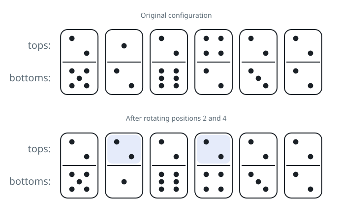

# Fewest Flips for a Matching Row

## Description

A row of dominoes is laid out lengthwise; `tops[i]` and `bottoms[i]` are
the two face values of tile `i`, each face carrying a number from `1` to
`6`.

Any tile may be flipped end over end, which swaps its two face values
between the top and the bottom row.

Find the minimum number of flips after which every value in the top row
is the same, or every value in the bottom row is the same. If no amount
of flipping can manage that, return `-1`.

### Example 1



```text
Input: tops = [2,1,2,4,2,2], bottoms = [5,2,6,2,3,2]
Output: 2
Explanation: The figure shows the row as dealt, before any flips.
Flipping the second and fourth tiles turns the whole top row into 2s, as
the second figure shows.
```

### Example 2

```text
Input: tops = [2,6,2,2], bottoms = [1,2,4,2]
Output: 1
Explanation: Value 2 appears on some face of every tile. Flipping just
the second tile puts 2 on top of it, completing a uniform top row
[2,2,2,2].
```

### Example 3

```text
Input: tops = [1,3,5], bottoms = [2,4,6]
Output: -1
Explanation: No value appears on any face of all three tiles, so no
sequence of flips can make either row uniform.
```

### Example 4

```text
Input: tops = [6,6,6], bottoms = [2,4,1]
Output: 0
Explanation: The top row already reads all 6s, so no flip is needed.
```

### Constraints

- `2 <= tops.length <= 2 * 10^4`
- `bottoms.length == tops.length`
- `1 <= tops[i], bottoms[i] <= 6`
