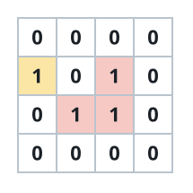
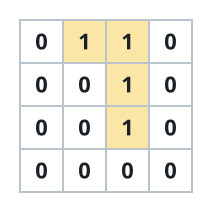

# Enclosed Land Cells

## Description

You are given an `m x n` binary matrix `grid`, where a `0` cell is water
and a `1` cell is land.

You can walk between two land cells whenever they share an edge, and from
any land cell lying on the grid's edge you can step off the grid.

A land cell is enclosed when no chain of such steps, however long, ever
carries you off the grid from it. Return how many of the land cells in
`grid` are enclosed.

### Example 1



```text
Input: grid = [[0,0,0,0],[1,0,1,0],[0,1,1,0],[0,0,0,0]]
Output: 3
Explanation: Three of the 1s form a cluster whose every edge neighbour is
water, so walking from any of them never reaches the edge. The remaining 1
sits on the boundary and can step straight off.
```

### Example 2



```text
Input: grid = [[0,1,1,0],[0,0,1,0],[0,0,1,0],[0,0,0,0]]
Output: 0
Explanation: Every 1 here either already lies on the boundary or is joined
to a boundary 1 through land, so the whole island can walk away and the
enclosed count is zero.
```

### Constraints

- `m == grid.length`
- `n == grid[i].length`
- `1 <= m, n <= 500`
- Every cell of `grid` is `0` or `1`.

## Hints

### Hint 1

Rather than asking, cell by cell, whether an escape route exists, think
about which land can leave: any land cell on the grid's edge can, and
whatever it reaches across land can too.

### Hint 2

Start a flood from every boundary land cell and spread through
edge-adjacent land. The answer is exactly the land the flood never
reaches; a queue, a stack, or union-find over the cells all work.
