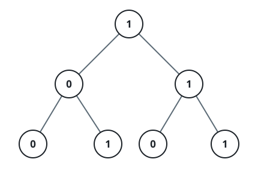

# Root-to-Leaf Binary Values

## Description

You are given the `root` of a binary tree in which every node stores a
single bit, `0` or `1`. Walking from the root down to any leaf and reading
the bits along the way, most significant bit first, spells out one binary
number per leaf — for instance, a path reading `1, 0, 1, 1` from the top
is `1011` in binary, worth `11`.

A leaf is a node with neither a left nor a right child. Take every leaf in
the tree, form its root-to-leaf number, and return the sum of all of them.

The tests are built so this total fits in a 32-bit integer.

### Example 1



```text
Input: root = [1,0,1,0,1,0,1]
Output: 22
Explanation: The four leaves sit under paths reading 100, 101, 110, and
111 — that is 4, 5, 6, and 7 — and 4 + 5 + 6 + 7 = 22.
```

### Example 2

```text
Input: root = [1,1,0,1,0]
Output: 15
Explanation: The two deepest leaves read 111 = 7 and 110 = 6, while the
right child is itself a leaf reading 10 = 2; 7 + 6 + 2 = 15.
```

### Constraints

- The tree holds between `1` and `1000` nodes.
- Every `Node.val` is `0` or `1`.

## Hints

### Hint 1

You never need to collect a list of bits: carry one running number down
each path, where arriving at a child doubles what you hold and adds that
child's bit.

### Hint 2

The running number is finished — and added into the total — only at
leaves; an internal node's bit is already baked into every number that
passes through it on the way down.
