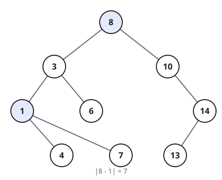
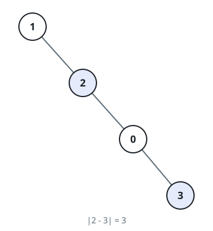

# Largest Ancestor-Descendant Gap

## Description

You are given the `root` of a binary tree. Look at every pair of nodes in
which one is an ancestor of the other: a node's ancestors are its parent,
its parent's parent, and so on up to the root, and a node is never its own
ancestor.

Each such pair contributes the absolute difference of the two node
values. Return the largest contribution over all ancestor-descendant
pairs in the tree.

### Example 1



```text
Input: root = [8,3,10,1,6,null,14,null,null,4,7,13]
Output: 7
Explanation: The widest pairing is the root 8 above the leaf 1, worth
|8 - 1| = 7; every other ancestor and descendant here sit closer
together, such as 8 over 3 (5) or 10 over 13 (3).
```

### Example 2



```text
Input: root = [1,null,2,null,0,3]
Output: 3
Explanation: The tree is a right-leaning chain, and its widest gap comes
from the node 0 against its own child 3.
```

### Constraints

- The tree holds between `2` and `5000` nodes.
- `0 <= Node.val <= 10⁵`

## Hints

### Hint 1

For any node playing the descendant, its best possible partner is one of
the extreme values sitting above it — an in-between ancestor can never
beat both extremes at once.

### Hint 2

That means one walk suffices: carry the minimum and maximum value seen so
far among the strict ancestors into each node, compare the node against
both, and fold its own value in before moving to its children.
