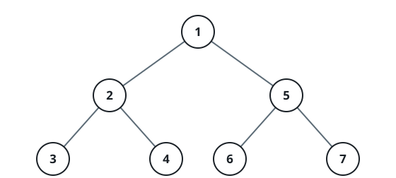
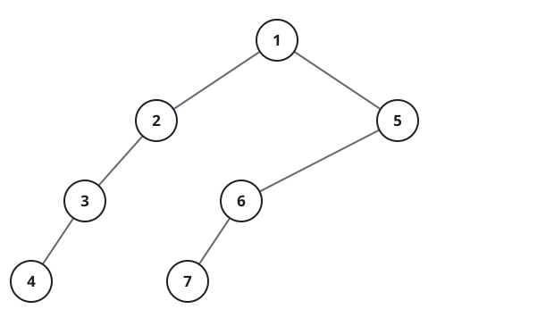
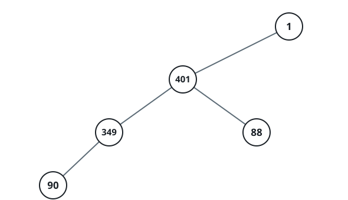

# Rebuild a Tree From Its Dashed Preorder

## Description

A binary tree was visited in preorder — node first, then left subtree, then
right subtree — and the visit was written down as one string. Each node
contributes a run of `D` dashes followed by the node's value, where `D` is
the node's depth: the root sits at depth 0, and every child of a depth-`D`
node sits at depth `D + 1`.

One guarantee keeps parent slots decidable: whenever a node has just one
child, that child is a left child.

Decode the string back into the tree it came from and return the root.

### Example 1



```text
Input: traversal = "1-2--3--4-5--6--7"
Output: [1,2,5,3,4,6,7]
```

### Example 2



```text
Input: traversal = "1-2--3---4-5--6---7"
Output: [1,2,5,3,null,6,null,4,null,7]
```

### Example 3



```text
Input: traversal = "1-401--349---90--88"
Output: [1,401,null,349,88,90]
```

### Constraints

- The tree holds between 1 and 1000 nodes.
- Every node value is between 1 and 10⁹.

## Hints

### Hint 1

Walk the string once, turning each dash run into a depth and the digits that
follow it into a value. Keep the nodes that could still take a child on the
current root-to-here path in a stack; the node at the new value's depth-1
position is its parent.
