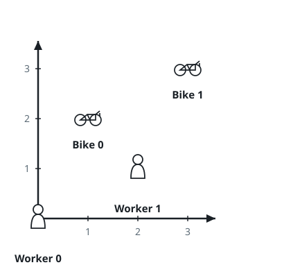
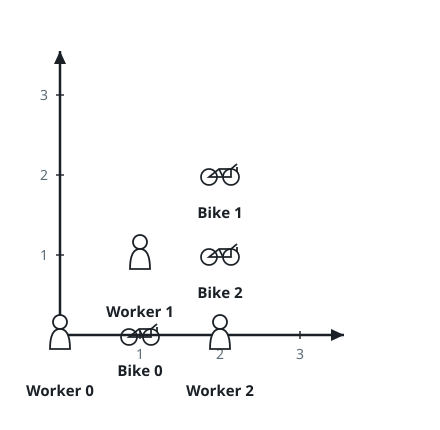

# Bike Assignments By Closest Pair

## Description

On a flat campus there live `n` workers and wait `m` shared bikes, with
`n <= m`. Every position is given in grid coordinates: `workers[i] =
[xi, yi]` locates the `i`-th worker and `bikes[j] = [xj, yj]` locates
the `j`-th bike, and all `n + m` positions are distinct.

Hand every worker a bike by repeating this rule until no worker is
left: among all workers that are still waiting and all bikes that are
still unclaimed, take the pair whose Manhattan distance is smallest.
Should several pairs share that smallest distance, prefer the pair
with the smallest worker index; if the best worker index is still
ambiguous, prefer the smallest bike index.

Return an array `answer` of length `n` where `answer[i]` is the index
of the bike handed to worker `i`.

The Manhattan distance between points `p1` and `p2` is
`|p1.x - p2.x| + |p1.y - p2.y|`.

### Example 1



```text
Input: workers = [[0,0],[2,1]], bikes = [[1,2],[3,3]]
Output: [1,0]
Explanation: Worker 1 stands closest to Bike 0, so that pair is claimed
first; Worker 0 then receives the only remaining bike, Bike 1.
```

### Example 2



```text
Input: workers = [[0,0],[1,1],[2,0]], bikes = [[1,0],[2,2],[2,1]]
Output: [0,2,1]
Explanation: Worker 0 claims Bike 0 first. Worker 1 and Worker 2 are
then equally close to Bike 2, so the smaller worker index wins: Worker
1 takes Bike 2, leaving Bike 1 for Worker 2.
```

### Constraints

- `n == workers.length`
- `m == bikes.length`
- `1 <= n <= m <= 1000`
- `workers[i].length == bikes[j].length == 2`
- `0 <= xi, yi < 1000`
- `0 <= xj, yj < 1000`
- All worker and bike locations are unique.

## Hints

### Hint 1

Line up every (worker, bike) pair as a record of its distance, worker
index, then bike index, and process the records from smallest to
largest — the statement's repeated "pick the globally closest pair"
falls out of a single ordered scan.

### Hint 2

While scanning, commit a record only if both its worker and its bike
are still unclaimed; stop once every worker has been served.
