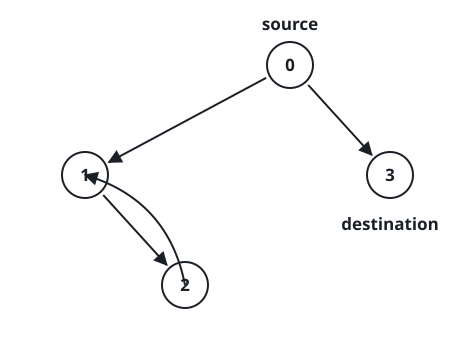
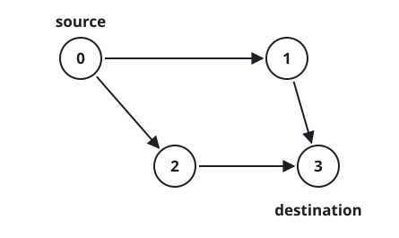

# Every Source Path Ends at the Target

## Description

A directed graph has `n` nodes numbered `0` to `n - 1`, given as an edge
list where `edges[i] = [ui, vi]` is one directed edge from `ui` to `vi`.
Two of its nodes are singled out: a starting node `source` and a goal
node `target`. Self-loops and parallel edges are both allowed.

Starting at `source`, you may follow directed edges arbitrarily many
times. Answer `true` exactly when every possible walk behaves the same
way: it terminates, and the node it stops on is `target`. That single
requirement packs in three conditions:

- `target` is reachable from `source` at all — at least one path
  connects them.
- Every node that `source` can reach and that has no outgoing edge is
  `target` itself; no walk may run off the graph somewhere else.
- No walk can continue forever, so there is no cycle reachable from
  `source`.

### Example 1


```text
Input: n = 3, edges = [[0,1],[0,2]], source = 0, target = 2
Output: false
Explanation: From node 0 a walk can stop at node 1, which has no
outgoing edge — and node 1 is not the target.
```

### Example 2



```text
Input: n = 4, edges = [[0,1],[0,3],[1,2],[2,1]], source = 0, target = 3
Output: false
Explanation: One walk stops at node 3 as intended, but another can chase
the edge pair 1 -> 2 -> 1 around forever without ever settling.
```

### Example 3



```text
Input: n = 4, edges = [[0,1],[0,2],[1,3],[2,3]], source = 0, target = 3
Output: true
```

### Constraints

- `1 <= n <= 10^4`
- `0 <= edges.length <= 10^4`
- `edges[i].length == 2`
- `0 <= ui, vi <= n - 1`
- `0 <= source <= n - 1`
- `0 <= target <= n - 1`
- The graph may contain self-loops and parallel edges.

## Hints

### Hint 1

Suppose some cycle is reachable from `source`. Once a walk steps onto
it, can it ever stop?

### Hint 2

It cannot — the walk is trapped going around forever, so any reachable
cycle immediately answers `false`.

### Hint 3

With no reachable cycle left, check every node `source` can reach: the
only one allowed to have no outgoing edges is `target`, and `target`
itself must not have any outgoing edges either.
