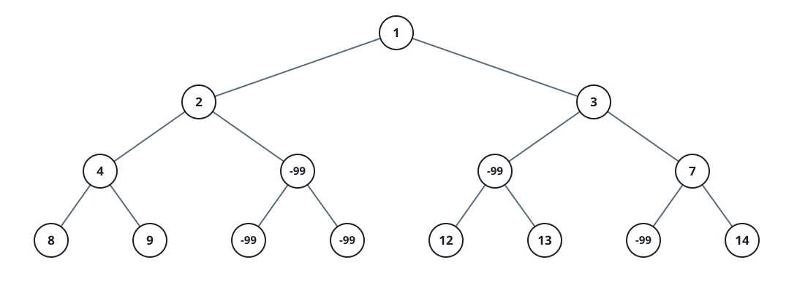
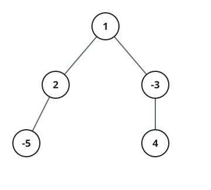

# Prune Weak Root-to-Leaf Paths

## Description

You are given the `root` of a binary tree and an integer `limit`. Cut
out every weak node and give back the `root` of the trimmed tree.

Call a node weak when each root-to-leaf path passing through it adds up
to a total strictly below `limit`. A leaf is a node with no children.

### Example 1



```text
Input: root = [1,2,3,4,-99,-99,7,8,9,-99,-99,12,13,-99,14], limit = 1
Output: [1,2,3,4,null,null,7,8,9,null,14]
```

### Example 2


```text
Input: root = [5,4,8,11,null,17,4,7,1,null,null,5,3], limit = 22
Output: [5,4,8,11,null,17,4,7,null,null,null,5]
```

### Example 3



```text
Input: root = [1,2,-3,-5,null,4,null], limit = -1
Output: [1,null,-3,4]
```

### Constraints

- The tree holds between `1` and `5000` nodes.
- `-10⁵ <= Node.val <= 10⁵`
- `-10⁹ <= limit <= 10⁹`

## Hints

### Hint 1

Walk the tree depth-first. While descending you can accumulate the path
sum from the root down to the current node, and while unwinding a
recursive DFS can hand back the largest sum of any downward path from
that node to a leaf — together those two numbers say whether the node
can still sit on a path that reaches `limit`.
