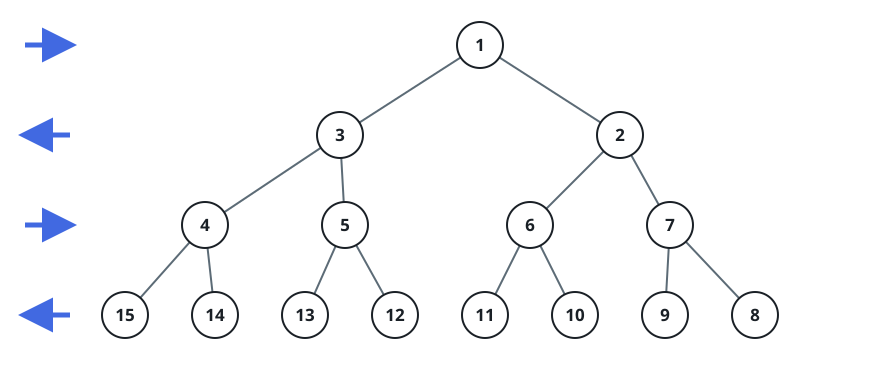

# Zigzag Tree Ancestors

## Description

Picture a perfect binary tree that grows without bound, in which every node
has exactly two children. The nodes receive their labels row by row from the
top, but the reading direction alternates: rows with an odd index (the
first, third, fifth, ...) are labelled left to right, while rows with an
even index (the second, fourth, sixth, ...) are labelled right to left.



Given the label of some node in this tree, report every label that appears
on the path from the root down to that node, starting at the root and
ending at the node itself.

### Example 1

```text
Input: label = 16
Output: [1,3,4,15,16]
```

### Example 2

```text
Input: label = 37
Output: [1,2,7,9,29,37]
```

### Constraints

- `1 <= label <= 10⁶`

## Hints

### Hint 1

Work with a node's place within its row rather than its raw label: the
parent always sits at half that place in the row above, and converting a
place back into a label only depends on which way the row reads.
