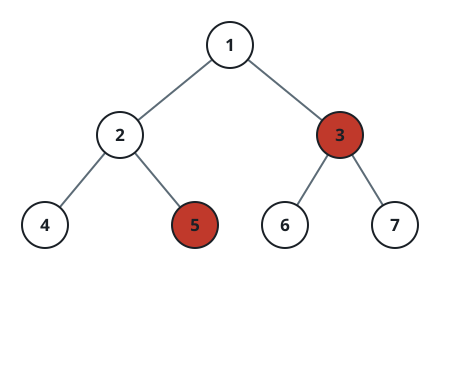

# Prune Nodes and Collect the Forest

## Description

You are given the root of a binary tree in which every node holds a
distinct value, along with a list `to_delete`. Remove every node whose
value appears in `to_delete`. Whenever a node is removed, its connection to
any surviving children is severed, and each of those children becomes the
root of its own separate tree. What is left is a forest — a disjoint
collection of trees.

Return the roots of all trees in the remaining forest, in any order.

### Example 1



```text
Input: root = [1,2,3,4,5,6,7], to_delete = [3,5]
Output: [[1,2,null,4],[6],[7]]
```

### Example 2

```text
Input: root = [2,1,4,null,null,3,5], to_delete = [4]
Output: [[2,1],[3],[5]]
```

### Example 3

```text
Input: root = [1,2,3,4,5], to_delete = [1,2]
Output: [[3],[4],[5]]
Explanation: Both 1 and 2 are removed, so 2's two children 4 and 5 are cut
loose, and 1's other child 3 survives as a lone root as well.
```

### Constraints

- The given tree contains at most 1000 nodes.
- Every node value is a distinct integer from 1 to 1000.
- `to_delete.length <= 1000`
- All values in `to_delete` are distinct integers from 1 to 1000.
