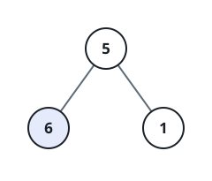

# Highest Subtree Average

## Description

You are given the `root` of a binary tree. Consider every subtree — a node
together with all of its descendants — and the average of its node values,
meaning the value sum divided by the node count. Return the largest
average found; answers within `10⁻⁵` of the true one are accepted.

### Example 1



```text
Input: root = [5,6,1]
Output: 6.00000
```

The whole tree averages `(5 + 6 + 1) / 3 = 4`, while each of the two
children forms a one-node subtree: `6 / 1 = 6` and `1 / 1 = 1`. The
child holding `6` wins.

### Example 2

```text
Input: root = [8,4,12,null,null,10,14]
Output: 14.00000
```

Every subtree averages at most `14` — the leaf holding it — and larger
groupings only pull the number down (the whole tree averages `9.6`).

### Example 3

```text
Input: root = [1,null,2,3]
Output: 3.00000
```

### Constraints

- The number of nodes in the tree is in the range `[1, 10⁴]`.
- `0 <= Node.val <= 10⁵`

## Hints

### Hint 1

If you knew each subtree's value sum and node count, the answer would be
an easy scan for the best ratio.

### Hint 2

Both numbers for a node compose directly from its children's numbers —
add the sums, add the counts, count the node itself once.

### Hint 3

That composition is a post-order depth-first walk: settle both subtrees,
then evaluate the node above them.
