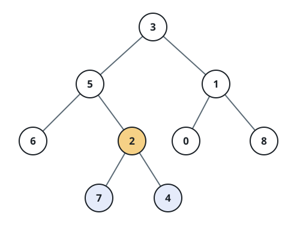

# Closest Shared Ancestor of the Deepest Leaves

## Description

You are given the `root` of a binary tree whose node values are unique.
Find the node that is the closest common ancestor of all its deepest
leaves, and return that node's subtree.

Two definitions pin the task down:

- A leaf is a node with no children, and the root sits at depth `0`; a
  child of a depth-`d` node sits at depth `d + 1`.
- The closest shared ancestor of a set of nodes is the deepest node whose
  subtree contains every one of them.

### Example 1



```text
Input: root = [3,5,1,6,2,0,8,null,null,7,4]
Output: [2,7,4]
```

The deepest leaves are `7` and `4`, at depth `3`; leaves `6`, `0`, and
`8` sit one level higher, so they don't compete. The shallowest node
covering both `7` and `4` is their parent `2`.

### Example 2

```text
Input: root = [4,1,6,null,null,5,7]
Output: [6,5,7]
```

`5` and `7` are the deepest leaves, and they already meet at their
parent `6`.

### Example 3

```text
Input: root = [5,null,9,8]
Output: [8]
```

The single deepest leaf `8` is its own closest shared ancestor.

### Constraints

- The number of nodes in the tree is in the range `[1, 1000]`.
- `0 <= Node.val <= 1000`
- All node values in the tree are unique.

### Follow-up

Can you settle both questions — how deep the deepest leaves are and
where they meet — in one traversal of the tree?

## Hints

### Hint 1

Work bottom-up: a node's own height is one more than the taller of its
two children's heights.

### Hint 2

At any node, whichever side reaches deeper holds every deepest leaf by
itself, so the answer lies on that side; only a tie means this node is
the meeting point.

### Hint 3

Starting at the root and repeatedly stepping into the taller side must
therefore stop exactly at the answer.
