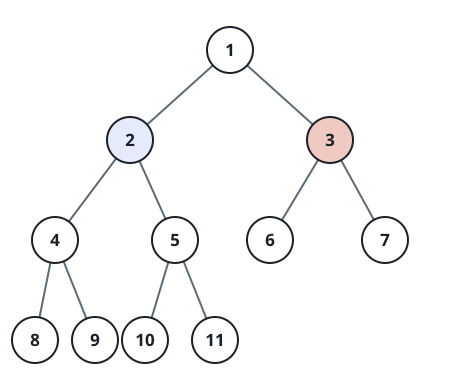

# Coloring Duel on a Binary Tree

## Description

Two players take turns painting nodes of a binary tree. You are given the
`root` of the tree and `n`, its number of nodes. `n` is odd, and the nodes
carry distinct values from `1` to `n`.

The opening moves are chosen: the first player names a value `x` with
`1 <= x <= n` and paints that node red, then the second player names a
value `y` with `1 <= y <= n` and `y != x` and paints that node blue.

After that the rounds begin, first player moving first. On a turn, a
player picks one of their own painted nodes and paints one unpainted
neighbor of it — the node's left child, right child, or parent. A player
who has no such move passes. When both players pass in a row the game
ends, and whoever painted more nodes wins.

You play the second player. Return `true` if some choice of `y` guarantees
you finish with more nodes than the first player, and `false` otherwise.

### Example 1



```text
Input: root = [1,2,3,4,5,6,7,8,9,10,11], n = 11, x = 3
Output: true
Explanation: The second player answers with the node valued 2 and
eventually claims that whole side of the tree — six of the eleven nodes.
```

### Example 2

```text
Input: root = [1,2,3,4,5,6,7], n = 7, x = 1
Output: false
Explanation: The two subtrees under the red root hold three nodes each and
nothing sits above the root, so blue can never get past half the tree.
```

### Example 3

```text
Input: root = [1,2,3,4,5], n = 5, x = 3
Output: true
Explanation: The red node is a leaf, so replying with its parent 1
delivers every remaining node — four of the five — to blue.
```

### Constraints

- `1 <= x <= n <= 100`
- `n` is odd.
- The node values are distinct and exactly the integers `1` through `n`.

## Hints

### Hint 1

Once red occupies `x`, the tree falls into at most three regions touching
it: the left subtree, the right subtree, and everything above. The
strongest blue reply always sits directly on this frontier.

### Hint 2

Count the three regions. Blue wins precisely when the largest of them
holds more than half of all `n` nodes.
