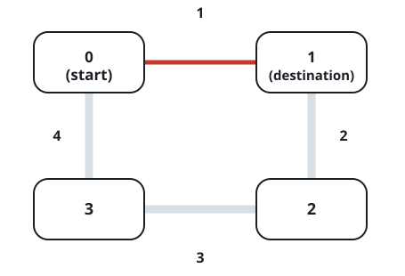
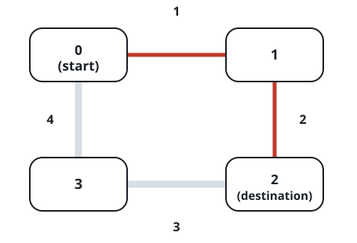
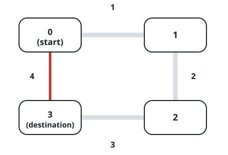

# Ring Route Distance

## Description

`n` bus stops, numbered `0` through `n - 1`, sit on a circular route. The
stretch between neighboring stops `i` and `(i + 1) % n` has length
`distance[i]`. A bus may travel around the ring in either direction, so
between two stops there are always two ways to go. Return the length of
the shorter way from `start` to `destination`.

### Example 1



```text
Input: distance = [1,2,3,4], start = 0, destination = 1
Output: 1
Explanation: Riding directly from stop 0 to stop 1 costs
distance[0] = 1; the long way around costs the remaining three edges,
2 + 3 + 4 = 9.
```

### Example 2



```text
Input: distance = [1,2,3,4], start = 0, destination = 2
Output: 3
Explanation: One direction rides edges 1 and 2 for a total of 3; the
other direction rides edges 3 and 4 for 7.
```

### Example 3



```text
Input: distance = [1,2,3,4], start = 0, destination = 3
Output: 4
Explanation: Visiting stops 0, 1, 2, 3 in order totals 1 + 2 + 3 = 6,
while riding the opposite way is the single edge of length 4.
```

### Constraints

- `1 <= n <= 10⁴`
- `distance.length == n`
- `0 <= start, destination < n`
- `0 <= distance[i] <= 10⁴`

## Hints

### Hint 1

The two routes between a pair of stops together cover every edge exactly
once, so their lengths always add up to the sum of the whole array — find
one and subtract.

### Hint 2

Edge `i` leaves stop `i` and arrives at stop `i + 1`, so the route that
runs through increasing stop numbers is one contiguous slice of
`distance`; sum that slice, compare it with the rest.
