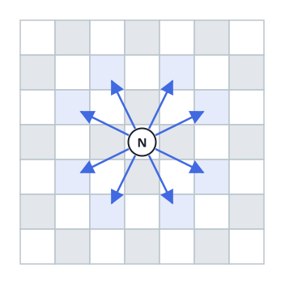

# Shortest Knight Route

## Description

Picture a chessboard that stretches without bound in every direction, its
squares addressed by integer coordinates. A knight starts on square
`[0, 0]`.

On each turn the knight makes one of its 8 standard moves: two squares
along one axis, then one square along the perpendicular axis.



How many such moves are required to bring the knight to the square
`[x, y]`? A reachable target is guaranteed, and the answer should be the
minimum possible move count.

### Example 1

```text
Input: x = 6, y = 6
Output: 4
Explanation: [0, 0] → [2, 1] → [4, 2] → [5, 4] → [6, 6]
```

### Example 2

```text
Input: x = 0, y = 5
Output: 3
Explanation: [0, 0] → [2, 1] → [1, 3] → [0, 5]
```

### Example 3

```text
Input: x = -4, y = 2
Output: 2
Explanation: Negative coordinates are ordinary squares — for instance
[0, 0] → [-2, 1] → [-4, 2].
```

### Constraints

- `-300 <= x, y <= 300`
- `0 <= |x| + |y| <= 300`

## Hints

### Hint 1

The bounds are small enough that exploring positions square by square is
feasible.

### Hint 2

Treat every square as a graph node and each of the 8 moves as an edge of
equal weight.

### Hint 3

Equal-weight shortest paths are exactly what a breadth-first search finds
first, so let the search run from the origin until the target appears.
