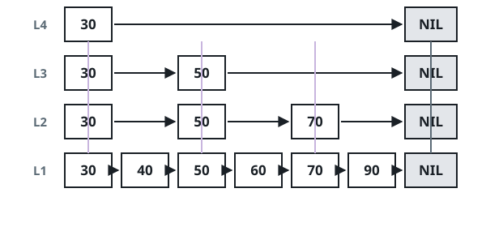

# Tiered Skip List

## Description

Build a skip list: a collection of integers stored across many layers,
where every layer is a sorted linked list and each higher layer samples the
one below it.

For example, suppose a skip list holds `[30,40,50,60,70,90]` and we want to
add `80` and `45` to it. The structure works like this:



Each layer is a sorted linked list, and the upper layers act as express
lanes over the bottom one: by descending only when the current node's next
value overshoots, `search`, `add`, and `erase` all run faster than a plain
scan — `O(log(n))` on average — while the whole structure still takes
`O(n)` space. (See also: skip list.)

Implement the `TieredSkipList` class:

- `TieredSkipList()` initializes an empty skip list.
- `boolean search(int target)` returns `true` if `target` exists in the
  skip list, or `false` otherwise.
- `void add(int num)` inserts `num` into the skip list.
- `boolean erase(int num)` removes one occurrence of `num` from the skip
  list and returns `true`, or returns `false` if `num` is not present.

### Example 1

```text
Input:
["TieredSkipList","add","add","add","search","search","erase","erase","search"]
[[],[7],[3],[9],[3],[5],[7],[7],[7]]
Output: [null,null,null,null,true,false,true,false,false]
Explanation: After inserting 7, 3, and 9, searching 3 finds it and
searching 5 does not. Erasing 7 succeeds the first time; the second erase
fails because 7 is gone, and a final search confirms it.
```

### Constraints

- `0 <= num, target <= 2 * 10⁴`
- At most `5 * 10⁴` calls are made to `search`, `add`, and `erase`.

## Hints

### Hint 1

Keep the bottom layer as the full sorted list and build each higher layer
by independently copying nodes from the layer below with probability one
half.

### Hint 2

A search descends a layer whenever it can no longer advance, which is what
keeps the expected cost logarithmic.
