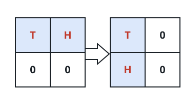
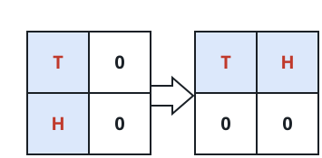
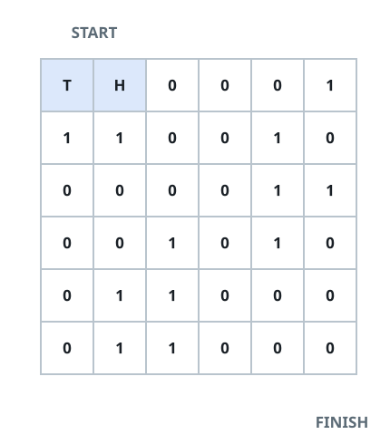

# Grid Snake Escape

## Description

An `n x n` grid holds a two-cell snake. Cells marked `0` are open and cells
marked `1` are blocked. The snake begins stretched horizontally across the
top-left corner, occupying `(0, 0)` and `(0, 1)`, and wants to reach the
bottom-right corner, occupying `(n-1, n-2)` and `(n-1, n-1)`.

Each move is one of the following:

- Slide one cell right, provided every cell the body would newly enter is
  open. The snake keeps its current horizontal or vertical posture.
- Slide one cell down, under the same condition.
- If the snake is horizontal and both cells directly beneath it are open, it
  may rotate clockwise: the pair `(r, c)` and `(r, c+1)` becomes `(r, c)` and
  `(r+1, c)`.



- If the snake is vertical and both cells directly to its right are open, it
  may rotate counterclockwise: the pair `(r, c)` and `(r+1, c)` becomes
  `(r, c)` and `(r, c+1)`.



In the diagrams the head `H` and tail `T` show how the body swings around
the tail. Return the fewest moves needed to reach the target, or `-1` if the
snake can never get there.

### Example 1



```text
Input: grid = [[0,0,0,0,0,1],
               [1,1,0,0,1,0],
               [0,0,0,0,1,1],
               [0,0,1,0,1,0],
               [0,1,1,0,0,0],
               [0,1,1,0,0,0]]
Output: 11
Explanation: One fastest route is [right, right, rotate clockwise, right,
down, down, down, down, rotate counterclockwise, right, down].
```

### Example 2

```text
Input: grid = [[0,0,0,0,0],
               [0,1,0,0,0],
               [0,0,0,1,1],
               [0,0,0,0,0],
               [0,0,0,0,0]]
Output: 9
Explanation: [right, right, rotate clockwise, down, down, down, right,
rotate counterclockwise, down] reaches the target in 9 moves.
```

### Example 3

```text
Input: grid = [[0,0,0],
               [0,1,0],
               [0,0,0]]
Output: -1
Explanation: The only open move is a single slide to the right; every
descent and both rotations would need the blocked center cell.
```

### Constraints

- `2 <= n <= 100`
- `0 <= grid[i][j] <= 1`
- The snake's two starting cells are guaranteed to be open.

## Hints

### Hint 1

Search breadth-first: every legal move costs exactly one step, so the first
time the search reaches the target is provably optimal.

### Hint 2

A state is the tail cell `(r, c)` together with the snake's orientation —
only `2 * n * n` states exist in total.
