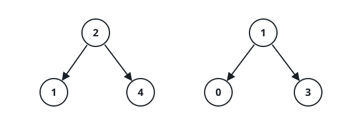
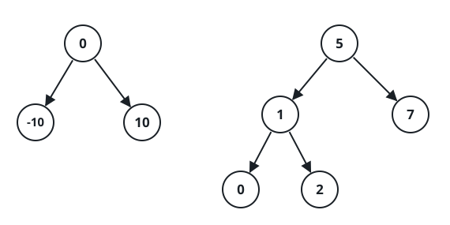

# Pair Sum Across Two Trees

## Description

You are given the roots of two binary search trees, `root1` and `root2`.
Decide whether some node in the first tree and some node in the second tree
have values adding up to `target` — that is, return `true` exactly when such
a cross-tree pair exists.

### Example 1



```text
Input: root1 = [2,1,4], root2 = [1,0,3], target = 5
Output: true
Explanation: Picking 2 from the first tree and 3 from the second gives
2 + 3 = 5.
```

### Example 2



```text
Input: root1 = [0,-10,10], root2 = [5,1,7,0,2], target = 18
Output: false
Explanation: Even the largest values from each tree only reach
10 + 7 = 17, so no pair can hit 18.
```

### Constraints

- Each tree holds between `1` and `5000` nodes.
- `-10⁹ <= Node.val, target <= 10⁹`

## Hints

### Hint 1

A binary search tree surrenders its values in ascending order to an
in-order traversal — use one on each tree to reduce the problem to two
sorted lists.

### Hint 2

With both lists sorted, scan one forward from its smallest value and the
other backward from its largest, moving whichever pointer brings the pair
sum toward `target`.
