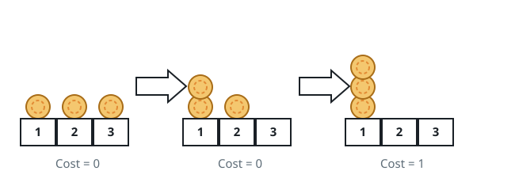
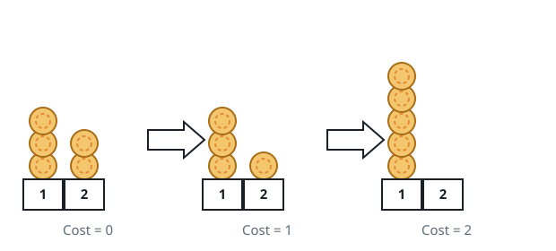

# Gathering the Chips

## Description

A row of chips sits on a number line; chip `i` rests at `position[i]`.
Gather every chip onto one shared position, paying for each move: sliding
a chip exactly two units in either direction is free, while nudging it
one unit costs `1`.

Return the smallest total cost that gathers all the chips together.

### Example 1



```text
Input: position = [1,2,3]
Output: 1
Explanation: The chip at 3 slides to 1 for free, then the chip at 2
nudges to 1 for a cost of 1. The total is 1.
```

### Example 2



```text
Input: position = [2,2,2,3,3]
Output: 2
Explanation: Both chips resting on 3 nudge over to 2, one unit each,
so the total cost is 2.
```

### Example 3

```text
Input: position = [4,12,7,19,22,9,1]
Output: 3
Explanation: Four chips sit on odd coordinates and three on even ones.
Paying one unit for each of the three even chips to cross over beats
moving the four odd chips, so the answer is 3.
```

### Constraints

- `1 <= position.length <= 100`
- `1 <= position[i] <= 10⁹`

## Hints

### Hint 1

A move of length two never changes whether a coordinate is even or odd.

### Hint 2

A move of length one always flips that parity, and it is the only move
that costs anything.

### Hint 3

Chips that already share a parity can therefore meet without spending
anything; the bill comes only from the chips whose parity differs from
the chosen target's.

### Hint 4

So the answer is just the smaller of the two parity counts.
