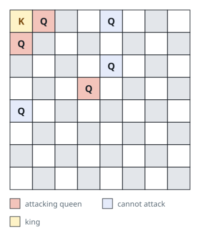
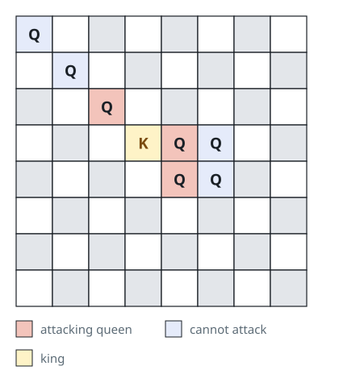

# Queens With a Clear Line

## Description

An `8 x 8` chessboard (indexed from `0`) holds several black queens and a
single white king.

`queens[i] = [xQueeni, yQueeni]` gives the square of the `i`th black queen,
and `king = [xKing, yKing]` gives the white king's square.

A queen attacks the king when she stands on the king's row, column, or
diagonal with no other queen between them — she moves like a chess queen,
and the nearest queen on a line of sight is the only one that counts.
Return the coordinates of every queen that directly attacks the king, in
any order.

### Example 1



```text
Input: queens = [[0,1],[1,0],[4,0],[0,4],[3,3],[2,4]], king = [0,0]
Output: [[0,1],[1,0],[3,3]]
Explanation: The diagram marks the three queens with an unobstructed
line to the king; the remaining queens (dashed) are not aligned with him.
```

### Example 2



```text
Input: queens = [[0,0],[1,1],[2,2],[3,4],[3,5],[4,4],[4,5]], king = [3,3]
Output: [[2,2],[3,4],[4,4]]
Explanation: The diagram marks the three queens that see the king along
a row, column, or diagonal; the dashed queens either lack a line or are
screened by a closer queen.
```

### Example 3

```text
Input: queens = [[5,5],[7,7],[2,5],[4,0]], king = [2,2]
Output: [[2,5],[4,0],[5,5]]
Explanation: Queens [2,5], [4,0], and [5,5] each share a row, column, or
diagonal with the king and face no intervening queen. [7,7] lies on the
same diagonal as [5,5] but hides behind her.
```

### Constraints

- `1 <= queens.length < 64`
- `queens[i].length == king.length == 2`
- `0 <= xQueeni, yQueeni, xKing, yKing < 8`
- No two given pieces share a square.

## Hints

### Hint 1

There are only eight directions a queen can move in — walk outward from
the king along each of them.

### Hint 2

On each direction, the first queen you meet is the answer for that ray;
stop there, since queens beyond her are shielded.
