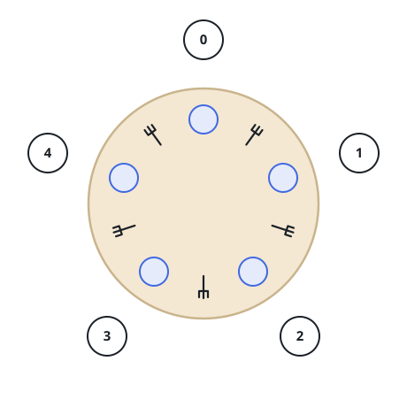

# Philosophers At a Round Table

## Description

Five silent philosophers sit at a round table with bowls of spaghetti, and
a fork lies on the table between every pair of neighbors. Each philosopher
alternates between thinking and eating, but a philosopher needs both their
left fork and their right fork to eat. Every fork can be held by only one
philosopher at a time, and after eating, a philosopher must put both forks
back so the neighbors can use them. There is no limit on spaghetti or
appetite.

Design a discipline of behavior — a concurrent algorithm — under which no
philosopher ever starves: each one can keep alternating between thinking
and eating forever, even though no philosopher can know when the others
will want to eat.



The philosophers are numbered `0` through `4` clockwise around the table.
Implement the `PhilosopherTable` class:

- `void wantsToEat(int philosopher, Runnable pickLeftFork, Runnable
pickRightFork, Runnable eat, Runnable putLeftFork, Runnable
putRightFork)` is called whenever philosopher `philosopher` wants to
  eat. Call `pickLeftFork`/`pickRightFork` to take the two neighboring
  forks, `eat` to eat one meal once both forks are held, and
  `putLeftFork`/`putRightFork` to release them. A philosopher is
  considered to be thinking whenever the function is not running for them.

Five threads — one per philosopher — share one `PhilosopherTable` object.
The function may be called for the same philosopher again even before an
earlier call for them has finished.

### Concurrent judging

The judge starts one real thread per meal call — `n` rounds per
philosopher, `5n` threads in all, each handed its philosopher id — all
sharing one `PhilosopherTable` object, started in the schedule's order,
which tells your solution nothing about when each thread actually runs.
Each of the five callbacks appends one structured entry to a shared log:
the fork callbacks record `[philosopher, "left"/"right", "pick"/"put"]`
and eating records `[philosopher, "eat"]`. Many interleavings are
correct, so the log is judged order-insensitively — a correct schedule is
one in which every philosopher completes every meal, contributing exactly
their `5n` entries. A solution that deadlocks never returns and is judged
as a timeout.

### Example 1

```text
Input: n = 1
Output: [[0,"left","pick"],[0,"right","pick"],[0,"eat"],[0,"left","put"],[0,"right","put"],[1,"left","pick"],[1,"right","pick"],[1,"eat"],[1,"left","put"],[1,"right","put"],[2,"left","pick"],[2,"right","pick"],[2,"eat"],[2,"left","put"],[2,"right","put"],[3,"left","pick"],[3,"right","pick"],[3,"eat"],[3,"left","put"],[3,"right","put"],[4,"left","pick"],[4,"right","pick"],[4,"eat"],[4,"left","put"],[4,"right","put"]]
Explanation: With n = 1, every philosopher eats exactly once. This log
shows one acceptable interleaving; any log in which all five philosophers
pick both forks, eat, and put both forks back — with no fork ever held by
two philosophers at once — is equally correct.
```

### Constraints

- `1 <= n <= 60`
